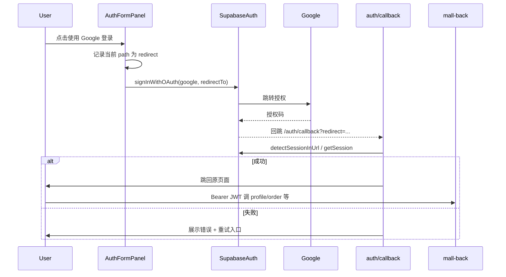

# feat: 客户端 Google 账户登录生产化

**Target repo:** mall（客户端）

## Summary

Supabase Auth 已启用 Google 登录后，客户端需把现有的「Google 登录」从可用雏形打造成可靠的生产链路：修好 OAuth 回跳与错误处理、保留登录前页面回流、完善中文引导文案，并补充配置与联调清单。客户端已有按钮与 `signInWithGoogle()`，本计划**不是从零新增按钮**，而是补齐缺口并验收全链路。

## Problem Frame

用户期望用 Google 账号一键登录客户端。现状：

- UI 已有「Sign in with Google」按钮，[`useSupabaseAuth`](app/composables/useSupabaseAuth.ts) 已调用 `signInWithOAuth({ provider: 'google' })`
- 回跳页 [`/auth/callback`](app/pages/auth/callback.vue) 过于简陋：仅等 `authLoading` 结束后跳转，不解析 OAuth 失败参数，文案为英文
- 发起 OAuth 时 `redirectTo` 固定为 `{origin}/auth/callback`，**未携带**登录前页面的 `redirect` 回流信息；回跳页虽能读 `?redirect=`，但启动时几乎从不写入
- 点击 Google 后若 OAuth 正常会整页跳离，当前 `emit('success')` 实际无意义且可能掩盖错误
- 缺少中文与配置文档，运维无法按清单核对 Supabase Redirect URLs / Google Console

## Product Contract

### Requirements

| ID | Requirement |
|----|-------------|
| R1 | 未登录用户可在登录面板点击 Google 登录，跳转 Google → Supabase → 回到客户端并建立会话 |
| R2 | OAuth 成功后回到用户发起登录前的页面（默认首页）；失败时在回跳页或登录面板展示可读错误 |
| R3 | Google 新用户经现有 Supabase Webhook/JWT 同步流程成为 `player`，可访问受保护 client API（profile / order / wallet / library） |
| R4 | 登录面板与回跳页关键文案为中文（与商店业务文案一致）；品牌按钮可保留 Google 官方色 |
| R5 | 文档说明：Supabase 启用 Google、Redirect URL 白名单、客户端环境变量与手工验收步骤 |

### Scope Boundaries

**本计划包含**

- 客户端 OAuth 启动参数（`redirectTo` + 回流路径）
- `/auth/callback` 错误处理与中文 UX
- 登录面板 Google 按钮交互修正与中文文案
- `.env.example` / `docs` 配置清单

**本计划不包含**

- 后端自行实现 Google OAuth（`config` 里 `[Google]` 段为历史遗留，本链路以 Supabase Auth 为准）
- Twitter / Apple 等其他第三方登录
- 匿名账号与 Google 身份 `linkIdentity` 深度合并（可记入后续；若实现成本低可作可选 U）
- Google Cloud Console 内实际创建 Client ID（由运维完成，计划只列所需回调 URL）

### Acceptance Examples

- **AE1**：未登录打开任意页 → 打开账户下拉 → 点「使用 Google 登录」→ 完成 Google 授权 → 回到原页且头像/昵称显示已登录
- **AE2**：在 Google 或 Supabase 侧拒绝/失败 → 回跳页显示错误原因，并提供「返回重试」
- **AE3**：Google 新用户登录后，调用 `GET /api/v1/client/profile`（带 Bearer）返回 200，证明后端用户已同步

## Key Technical Decisions

1. **鉴权权威仍是 Supabase Auth**  
   客户端只调 `signInWithOAuth`；后端继续验 JWT + Webhook 建用户。不启用 mall-back 的独立 Google OAuth 路由。

2. **回流信息放在 callback URL 的 query 中**  
   `redirectTo = \`${origin}/auth/callback?redirect=\${encodeURIComponent(safePath)}\``，并确保该完整 URL（或至少 `/auth/callback`）已加入 Supabase Auth Redirect URLs。`safePath` 仅允许站内相对路径，防止开放重定向。

3. **回跳页负责会话落地与错误展示**  
   利用已开启的 `detectSessionInUrl: true`；额外解析 URL 中的 `error` / `error_description`（hash 或 query）。成功再 `router.replace(safeRedirect)`。

4. **文案中文化，按钮保留 Google 品牌色**  
   符合设计系统对第三方品牌按钮的例外约定。

## High-Level Technical Design

## Implementation Units

### U1. 加固 Google OAuth 启动与安全回流

**Goal:** 点击 Google 登录时带上安全的站内回流地址，并修正「假成功」交互。

**Requirements:** R1, R2

**Dependencies:** 无

**Files:**
- `app/composables/useSupabaseAuth.ts`
- `app/components/layout/AuthFormPanel.vue`

**Approach:**
- `signInWithGoogle` 接受可选 `redirectPath`；组装 `redirectTo` 时附带 `?redirect=`
- 增加路径消毒：仅允许以 `/` 开头且禁止 `//`、外链
- AuthFormPanel：用当前 `route.fullPath`（或 path+query）作为回流；OAuth 返回 `ok` 后**不要** `emit('success')`（即将整页跳转）；仅在本地错误时展示 `authError`
- 按钮文案改为中文：「使用 Google 登录」；pending 态显示「正在跳转…」

**Test scenarios:**
- Happy path：传入 `/product/103?locale=zh-CN`，生成的 `redirectTo` 含编码后的 redirect
- Edge：`redirect=https://evil.com` 或 `//evil.com` → 回落到 `/`
- Error：Supabase 返回 OAuth 配置错误 → UI 展示 `authError`，不关闭面板

**Verification:** 本地点 Google 按钮后，浏览器落点 URL 的 `redirect_to`（或 Supabase 授权请求）包含预期 callback。

---

### U2. 完善 `/auth/callback` 回跳体验

**Goal:** OAuth 回跳后正确建立会话、处理失败、安全跳转，文案中文化。

**Requirements:** R1, R2, R4

**Dependencies:** U1

**Files:**
- `app/pages/auth/callback.vue`
- （可选）`app/composables/useAuthRedirect.ts` — 若路径消毒/解析逻辑需复用

**Approach:**
- 解析 `route.query` / `route.hash` 中的 OAuth `error`、`error_description`
- 成功：等待 session 就绪（现有 `authLoading` 或显式 `getSession`）后 `replace` 到消毒后的 redirect
- 失败：中文错误说明 + 「返回首页 / 重新登录」链接（不自动死循环跳转）
- `useSeoMeta` / 页面文案改为中文（「正在完成登录…」）

**Test scenarios:**
- Happy：携带有效 session 落地 → 跳到 `redirect` 指定页
- Error：`?error=access_denied` → 停留回跳页展示错误
- Edge：无 redirect 参数 → 回首页 `/`
- Edge：恶意 redirect → 回首页

**Verification:** 手动完成一次 Google 登录与一次拒绝授权，分别验证成功回流与错误页。

---

### U3. 登录面板中文与可用性收尾

**Goal:** Google 登录入口在中文商店语境下可读、可理解；错误反馈一致。

**Requirements:** R4

**Dependencies:** U1

**Files:**
- `app/components/layout/AuthFormPanel.vue`

**Approach:**
- 将 Google 相关与必要的面板说明改为中文（至少：标题副文案、Google 按钮、协议提示中与 Google 相关句）
- 保持 Google 四色图标与 outline 按钮样式
- 确认 `authPending` 时 Google 按钮禁用，避免重复点击

**Test expectation:** none — 文案与交互态变更；以手工视觉验收为主。

**Verification:** 打开账户下拉，中文文案与 disabled/pending 态正确。

---

### U4. 配置清单、环境变量说明与联调验收

**Goal:** 给出可执行的 Supabase / 客户端配置与 AE1–AE3 验收步骤，便于运维与开发对齐。

**Requirements:** R3, R5

**Dependencies:** U1, U2

**Files:**
- `docs/auth-google-login.md`（新建）
- `.env.example`
- （可选交叉引用）`docs/api-client.md`

**Approach:**
- 文档列出：
  1. Supabase Dashboard → Auth → Providers → Google 启用
  2. Redirect URLs 需包含：`http://localhost:3000/auth/callback`、生产 `https://<client-domain>/auth/callback`（若带 query，确认 Supabase 通配/前缀规则）
  3. Google Cloud OAuth Client 的 Authorized redirect URIs 使用 **Supabase 提供的回调**（形如 `https://<project>.supabase.co/auth/v1/callback`），不是客户端域名
  4. 客户端需配置 `NUXT_PUBLIC_SUPABASE_URL` / `NUXT_PUBLIC_SUPABASE_ANON_KEY`
  5. 验收：Google 登录成功后 `GET /api/v1/client/profile` 带 Bearer 返回 200（验证 Webhook/JWT 同步）
- `.env.example` 增加一行注释说明 Google 登录依赖上述 Supabase URL/Anon Key，无需额外 NUXT Google Client ID（客户端走 Supabase）

**Test expectation:** none — 文档与配置说明。

**Verification:** 按文档在开发环境完成一次 Google 登录，并成功拉取 profile。

---

### U5.（可选）匿名用户升级为 Google 账号

**Goal:** 「Continue as guest」后再绑 Google 时尽量保留身份，避免产生断层账号。

**Requirements:** R3（增强）

**Dependencies:** U1, U2

**Files:**
- `app/composables/useSupabaseAuth.ts`
- `app/components/layout/AuthFormPanel.vue`

**Approach:**
- 若当前为匿名会话，优先尝试 `linkIdentity` / Supabase 推荐的 identity linking API；失败则回退为普通 OAuth 登录并提示「将创建新登录方式」
- **若联调中发现 Supabase 版本/策略不支持或风险过高，将本单元整段移入「后续工作」而不阻塞 U1–U4**

**Test scenarios:**
- 匿名登录后点 Google 且 linking 成功 → 同一 user id，可访问原会话相关数据
- linking 失败 → 明确错误或回退路径，不静默丢数据

**Verification:** 匿名 → Google 绑定路径在开发环境跑通一次，或明确记录「本阶段跳过」原因。

## Risks & Dependencies

| 风险 | 缓解 |
|------|------|
| Supabase Redirect URL 未放行导致 `redirect_uri_mismatch` | U4 清单 + U2 错误展示 |
| Webhook 未触发导致 Google 新用户无 `users` 行、profile 401/404 | AE3 验收；对照 `mall-back/docs/auth-user-sync-design.md` |
| 开放重定向 | U1/U2 路径消毒 |
| 仅改客户端但 Google Provider 未开 | 实施前与运维确认 Provider 已启用（用户已声明「supabase 已支持」） |

**依赖：** Supabase 项目已开启 Google Provider；GoTrue → mall-back `after-user-created` Webhook 在开发/生产可用。

## Open Questions

1. **匿名 → Google 是否必须本期做？** 默认 U5 可选；若不做，登录面板可暂时保留 guest，与 Google 并列即可。
2. **回跳是否需要 PKCE / `query` vs `hash` 模式统一？** 实施时对照当前 `@supabase/supabase-js` 默认；若 `detectSessionInUrl` 已覆盖则不额外改 flow type。

## Assumptions

- 用户所述「Supabase 已支持 Google」指 Provider 已在目标环境开启；客户端密钥仍走现有 Anon Key，不新增 Google Client ID 到 Nuxt public config。
- 后端用户同步沿用现有设计，Google 登录用户与邮箱用户同为 `player`。
- Product Contract 由本计划 bootstrap，无上游 brainstorm 文档。

## Definition of Done

- [ ] Google 登录可完成授权并建立 Supabase session
- [ ] 成功回流到登录前站内页面；失败有中文错误提示
- [ ] AE3：登录后 profile API 可用
- [ ] 配置文档已写入 `docs/auth-google-login.md`
- [ ] 不引入对 mall-back 独立 Google OAuth 的依赖

## Sources & Research

- 现有实现：`app/composables/useSupabaseAuth.ts`、`app/components/layout/AuthFormPanel.vue`、`app/pages/auth/callback.vue`、`app/plugins/supabase.client.ts`
- 后端用户同步：`mall-back/docs/auth-user-sync-design.md`
- 设计系统：第三方品牌按钮可用品牌色（`.cursor/rules/design-system.mdc`）
